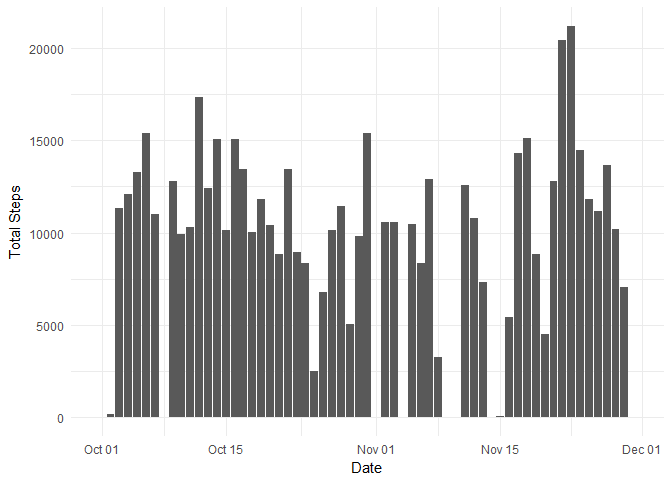
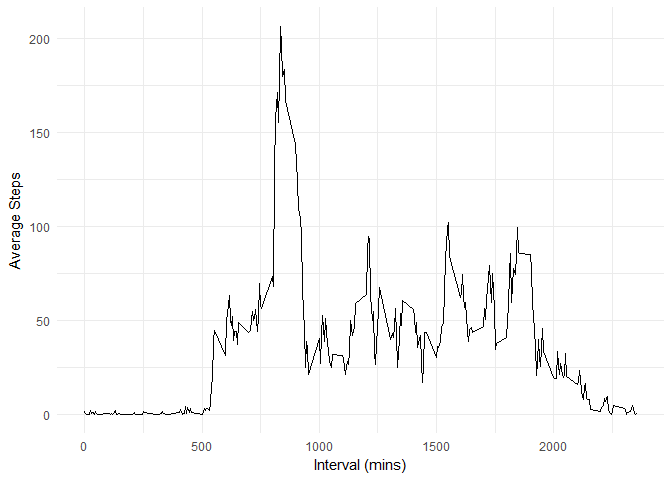
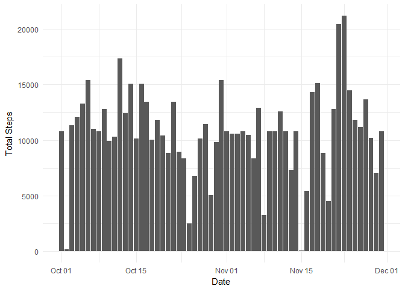
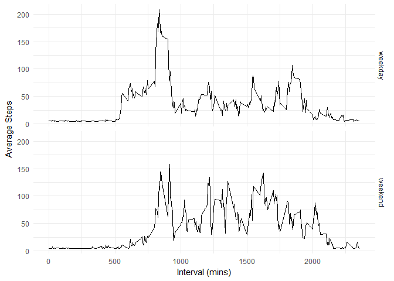

**Setup**
---------

``` r
#getwd()
setwd('~/datasciencecoursera/RepData_PeerAssessment1')

library(tidyverse)
library(knitr)
knitr::opts_chunk$set(echo = TRUE)
```

**Loading and Preprocessing Data**
----------------------------------

``` r
data_url <- 'https://d396qusza40orc.cloudfront.net/repdata%2Fdata%2Factivity.zip'

if(!file.exists("./activity.zip")) {
      download.file(data_url, "activity.zip")
}

if(!file.exists("./activity.csv")) {
      unzip("activity.zip")
}

activity_data <-
      read_csv('./activity.csv')
```

**What is mean total number of steps taken per day?**
-----------------------------------------------------

### 1. Calculate the total number of steps taken per day.

``` r
steps_by_day <-
      activity_data %>%
      group_by(date) %>%
      summarise(total_steps = sum(steps, na.rm = TRUE))

head(steps_by_day)
```

    ## # A tibble: 6 x 2
    ##   date       total_steps
    ##   <date>           <int>
    ## 1 2012-10-01           0
    ## 2 2012-10-02         126
    ## 3 2012-10-03       11352
    ## 4 2012-10-04       12116
    ## 5 2012-10-05       13294
    ## 6 2012-10-06       15420

### 2. Make a histogram of the total number of steps taken each day.

``` r
ggplot(data = steps_by_day, aes(x = date, y = total_steps)) +
      geom_histogram(stat = "identity") +
      labs(x = "Date", y = "Total Steps") +
      theme_minimal()
```



### 3. Calculate and report the mean and median of the total number of steps taken per day.

``` r
steps_by_day %>%
      summarise(mean_total_steps_per_day = mean(total_steps, na.rm = TRUE)
                ,median_total_steps_per_day = median(total_steps, na.rm = TRUE)) %>%
      kable(align = 'c', col.names = c("Mean Total Steps per Day", "Median Total Steps per Day"))
```

| Mean Total Steps per Day | Median Total Steps per Day |
|:------------------------:|:--------------------------:|
|          9354.23         |            10395           |

**What is the average daily activity pattern?**
-----------------------------------------------

### 1. Make a time series plot of the 5-minute interval (x-axis) and the average number of steps taken, averaged across all days (y-axis)

``` r
ts_plot <-
      activity_data %>%
      group_by(interval) %>%
      summarise(avg_steps = mean(steps, na.rm = TRUE))

ggplot(data = ts_plot, aes(x = interval, y = avg_steps)) +
      geom_line() +
      labs(x = "Interval (mins)", y = "Average Steps") +
      theme_minimal()
```



### 2. Which 5-minute interval, on average across all the days in the dataset, contains the maximum number of steps?

``` r
ts_plot %>%
      arrange(desc(avg_steps)) %>%
      head(1) %>%
      kable(align = 'c', col.names = c("Interval", "Average Steps"), caption = "Interval with the Maximum Number of Average Steps")
```

| Interval | Average Steps |
|:--------:|:-------------:|
|    835   |    206.1698   |

**Imputing missing values**
---------------------------

### 1. Calculate and report the total number of missing values in the dataset (i.e. the total number of rows with NAs)

``` r
sum(is.na(activity_data)) %>%
      kable(align = 'c', col.names = 'Total NAs')
```

| Total NAs |
|:---------:|
|    2304   |

### 2. Devise a strategy for filling in all of the missing values in the dataset.

### 3. Create a new dataset that is equal to the original dataset but with the missing data filled in.

``` r
new_activity_data <-
      activity_data %>%
      replace_na(list(steps = mean(activity_data$steps, na.rm = TRUE)))

head(new_activity_data)
```

    ## # A tibble: 6 x 3
    ##   steps date       interval
    ##   <dbl> <date>        <int>
    ## 1  37.4 2012-10-01        0
    ## 2  37.4 2012-10-01        5
    ## 3  37.4 2012-10-01       10
    ## 4  37.4 2012-10-01       15
    ## 5  37.4 2012-10-01       20
    ## 6  37.4 2012-10-01       25

### 4. Make a histogram of the total number of steps taken each day and Calculate and report the mean and median total number of steps taken per day.

``` r
new_steps_by_day <-
      new_activity_data %>%
      group_by(date) %>%
      summarise(total_steps = sum(steps, na.rm = TRUE))

ggplot(data = new_steps_by_day, aes(x = date, y = total_steps)) +
      geom_histogram(stat = "identity") +
      labs(x = "Date", y = "Total Steps") +
      theme_minimal()
```



``` r
new_steps_by_day %>%
      summarise(mean_total_steps_per_day = mean(total_steps, na.rm = TRUE)
                ,median_total_steps_per_day = median(total_steps, na.rm = TRUE)) %>%
      kable(align = 'c', col.names = c("Mean Total Steps per Day", "Median Total Steps per Day"))
```

| Mean Total Steps per Day | Median Total Steps per Day |
|:------------------------:|:--------------------------:|
|         10766.19         |          10766.19          |

**Are there differences in activity patterns between weekdays and weekends?**
-----------------------------------------------------------------------------

### 1. Create a new factor variable in the dataset with two levels - "weekday" and "weekend".

``` r
new_activity_data <-
      new_activity_data %>%
      mutate(day_type = case_when(weekdays(date) %in% c('Saturday', 'Sunday') ~ "weekend"
             ,TRUE ~ "weekday"))

head(new_activity_data)
```

    ## # A tibble: 6 x 4
    ##   steps date       interval day_type
    ##   <dbl> <date>        <int> <chr>   
    ## 1  37.4 2012-10-01        0 weekday 
    ## 2  37.4 2012-10-01        5 weekday 
    ## 3  37.4 2012-10-01       10 weekday 
    ## 4  37.4 2012-10-01       15 weekday 
    ## 5  37.4 2012-10-01       20 weekday 
    ## 6  37.4 2012-10-01       25 weekday

### 2. Make a panel plot containing a time series plot of the 5-minute interval (x-axis) and the average number of steps taken, averaged across all weekday days or weekend days (y-axis).

``` r
new_ts_plot <-
      new_activity_data %>%
      group_by(interval, day_type) %>%
      summarise(avg_steps = mean(steps, na.rm = TRUE))

ggplot(data = new_ts_plot, aes(x = interval, y = avg_steps)) +
      geom_line() +
      facet_grid(day_type ~ .) +
      labs(x = "Interval (mins)", y = "Average Steps") +
      theme_minimal()
```


